

<picture>
  <source media="(prefers-color-scheme: dark)" srcset="./assets/header_main.svg">
  <source media="(prefers-color-scheme: light)" srcset="./assets/header_light_main.svg">
  
</picture>

  

<picture>
  <source media="(prefers-color-scheme: dark)" srcset="./assets/nav_label.svg">
  <source media="(prefers-color-scheme: light)" srcset="./assets/nav_label_light.svg">
  
</picture>

 

<!-- 4 NAV/CONTACT BUTTONS — equal 132x36 dimensions, calibrated colors, centered alignment -->
<a href="https://zubairsystems.tech">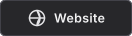</a>&nbsp;&nbsp;&nbsp;&nbsp;&nbsp;&nbsp;

 

<!-- Real Live Dynamic Profile Views Counter (Auto-Increments on Every Refresh) -->

## About

I build digital products, systems, and AI-powered tools with a focus on performance, usability, and solving real problems.

My work spans product engineering, automation, and intelligent systems - from polished interfaces to the infrastructure and logic that power them.

I enjoy taking ideas from an early concept to something real, useful and ready to be used.

## What I Build

<picture>
  <source media="(prefers-color-scheme: dark)" srcset="./assets/capabilities.svg">
  <source media="(prefers-color-scheme: light)" srcset="./assets/capabilities_light.svg">
  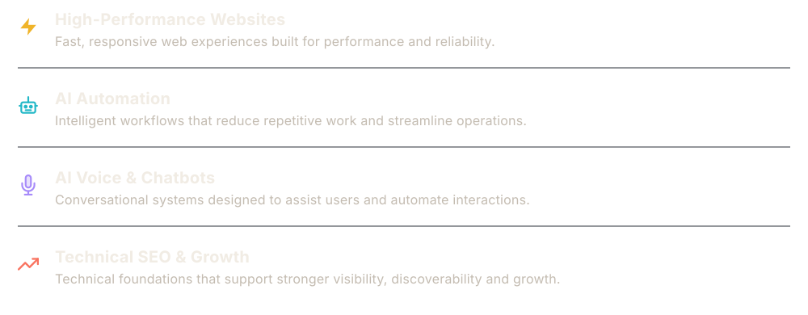
</picture>

## Stack

 

<b>WEB ENGINEERING</b>

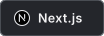&nbsp;
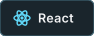&nbsp;
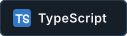&nbsp;
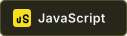&nbsp;
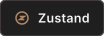&nbsp;
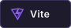&nbsp;
&nbsp;
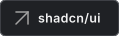&nbsp;
&nbsp;
&nbsp;
&nbsp;
&nbsp;
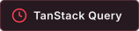

   

<b>AI SYSTEMS</b>

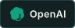&nbsp;
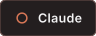&nbsp;
&nbsp;
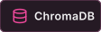&nbsp;
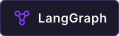&nbsp;
&nbsp;
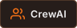&nbsp;
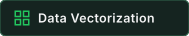&nbsp;
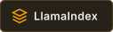&nbsp;
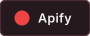&nbsp;
&nbsp;
&nbsp;
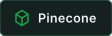

   

<b>AUTOMATION & AGENTS</b>

&nbsp;
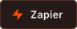&nbsp;
&nbsp;
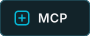&nbsp;
&nbsp;

   

<b>CONVERSATIONAL AI</b>

&nbsp;
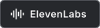&nbsp;
&nbsp;
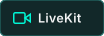&nbsp;
&nbsp;

   

<b>BACKEND & DATA</b>

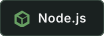&nbsp;
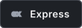&nbsp;
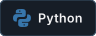&nbsp;
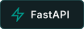&nbsp;
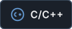&nbsp;
&nbsp;
&nbsp;
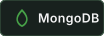&nbsp;
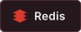&nbsp;
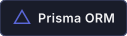&nbsp;
&nbsp;
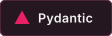

   

<b>DEPLOYMENT & INFRASTRUCTURE</b>

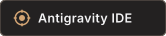&nbsp;
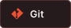&nbsp;
&nbsp;
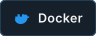&nbsp;
&nbsp;
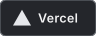&nbsp;
&nbsp;
&nbsp;
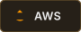&nbsp;
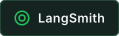&nbsp;
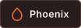

  

## Contribution Activity

 

<!-- 3 Individual Stats Cards — responsive unified row for flawless mobile & desktop alignment -->
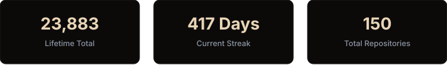

  

<!-- Full 3D Contribution Landscape & 5-Axis Radar (Rolling 1-Year) -->
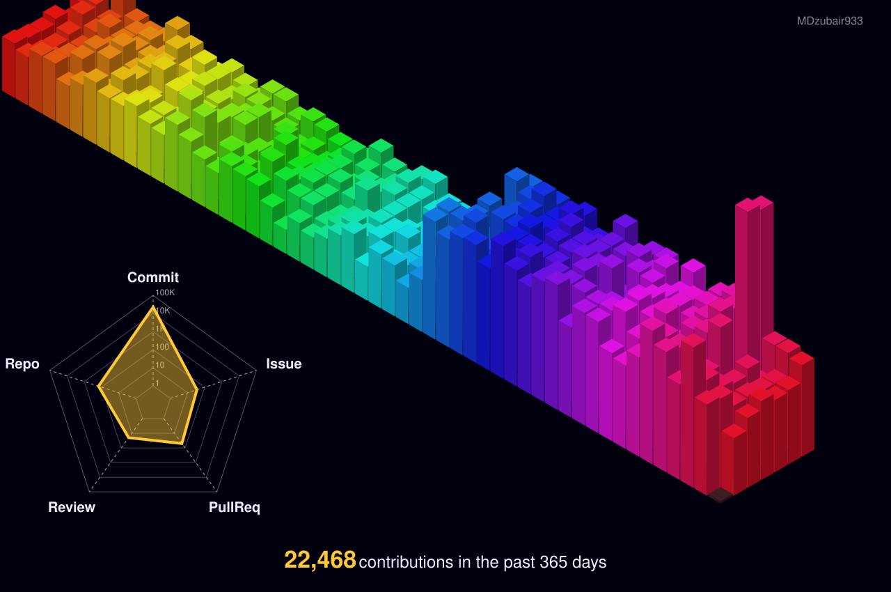

  

<!-- Dedicated Most Used Languages & Codebase Distribution Card -->
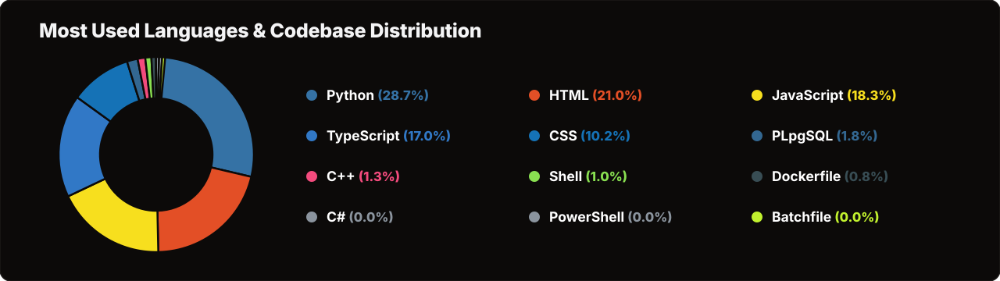

  

## Have an Interesting Problem?

I like working on things that are difficult, useful, and worth building properly. 
Whether it's a high-performance website, an intelligent workflow, or something entirely different - let's talk and see if it's worth building.

 
&nbsp;&nbsp;&nbsp;&nbsp;&nbsp;&nbsp;&nbsp;&nbsp;&nbsp;&nbsp;&nbsp;&nbsp;&nbsp;&nbsp;&nbsp;&nbsp;&nbsp;&nbsp;&nbsp;&nbsp;

